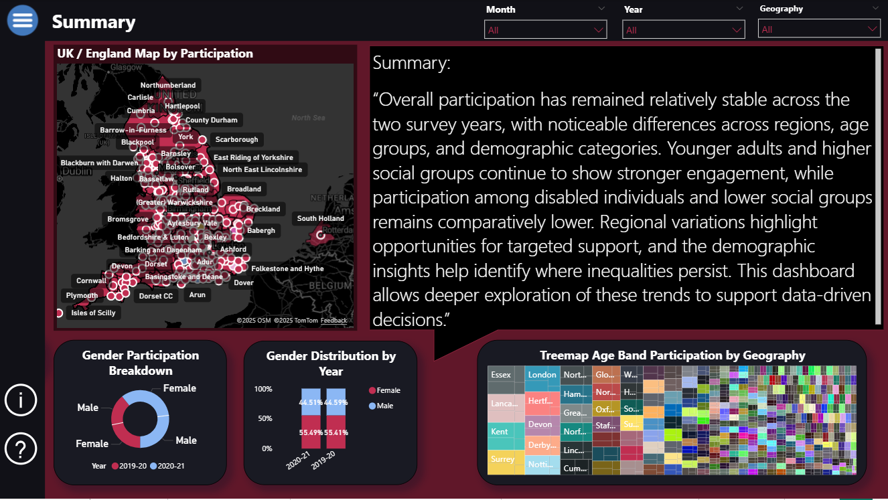
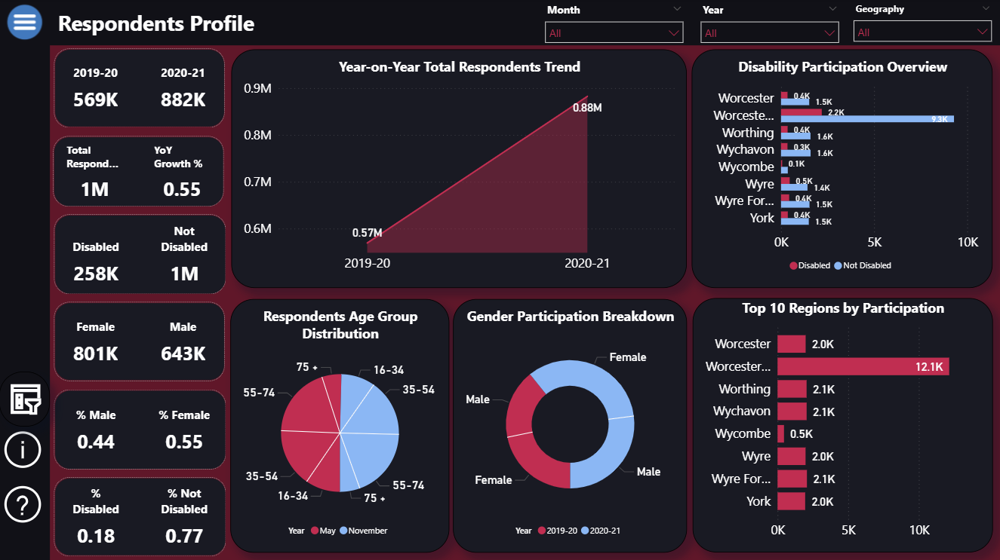
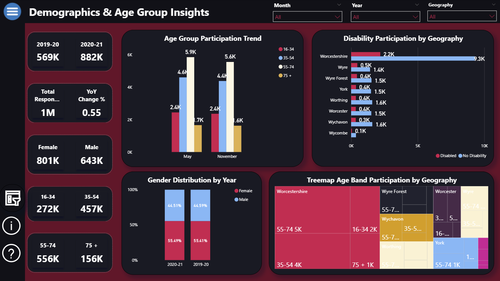
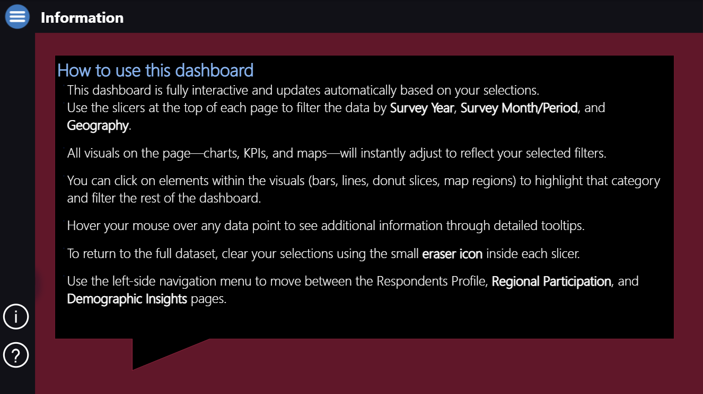
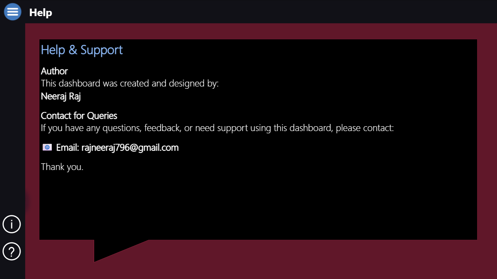

📊 Sport England Participation Insights Dashboard
Built with Power BI | By Neeraj Raj Srinivasa Raju

This project presents a complete analytical dashboard built using Sport England’s Active Lives Survey (2019–20 & 2020–21).
The dashboard uncovers participation trends, demographic patterns, and regional variations to support data-driven decisions in sport development and policy planning.

Built with a star-schema data model, optimised DAX, a custom UI theme, and intuitive navigation, this dashboard is designed for both technical and non-technical stakeholders.

🧠 Project Description

The Active Lives Survey provides insight into how people across England engage in sports and physical activities.
This Power BI report transforms raw data into an interactive insight tool with:

Year-on-year trend analysis

Demographic segmentation (age, gender, disability)

Local authority and regional participation patterns

National vs area comparisons

Insightful treemaps, maps, KPIs, and slicer-driven interactions

Advanced DAX (CALCULATE, DIVIDE, SUMX, FILTER, SELECTEDVALUE, SWITCH) were used for all KPIs and interactive calculations.

📌 Dashboard Pages, Screenshots, and Code
🟣 1. Summary Page

The Summary Page provides an executive overview of participation across England. It includes the interactive map, gender and demographic breakdowns, and a written narrative summarising the overall insights.

🔍 Highlights:

High-level national participation patterns

Map-based overview of key areas

Gender distribution

Demographic treemap

Narrative explaining trends and disparities

🟣 2. Respondents Profile

This page deep-dives into who the respondents are.
It showcases gender split, disability split, total respondents, YoY growth, age distribution, and top-performing regions.

🔍 Highlights:

2019–20 vs 2020–21 total respondents

Year-on-year growth (%)

Age group distribution

Gender and disability breakdown

Top 10 regions by participation

🟣 3. Regional & Local Authority Participation

This page focuses on geographic behaviour and regional analytics.
It includes an interactive map, area vs national average, yearly change charts, and age-band participation by region.

🔍 Highlights:

UK/England participation mapped geographically

YoY gain/loss for each local authority

Area vs national average KPI donut

Age-band participation patterns across regions

🟣 4. Demographics & Age Group Insights

This page focuses on understanding how demographics behave over time.

🔍 Highlights:

Age group participation trends

Disability participation by geography

Gender distribution year-on-year

Age-band treemap across regions

🟣 5. Information Page

This page helps new users understand how to interact with the dashboard.

💡 Purpose:

How slicers work

How visuals interact

How to clear filters

Navigation instructions

Designed for non-technical stakeholders

🟣 6. Help Page

This page displays author details and contact information for dashboard support.

💬 Contains:

Author credit

Contact email: rajneeraj796@gmail.com

Dashboard support message

🧩 Data Model Overview

This project uses a clean star schema:

📘 Fact Tables:

Fact_2019_20

Fact_2020_21

📙 Dimension Tables:

Dim_Geography

Dim_Year

Dim_Period / Month

🧮 Key DAX Used:

CALCULATE()

DIVIDE()

SUMX()

FILTER()

SELECTEDVALUE()

SWITCH()

📬 Contact

For queries related to this dashboard:

Neeraj Raj Srinivasa Raju
📧 Email: rajneeraj796@gmail.com
