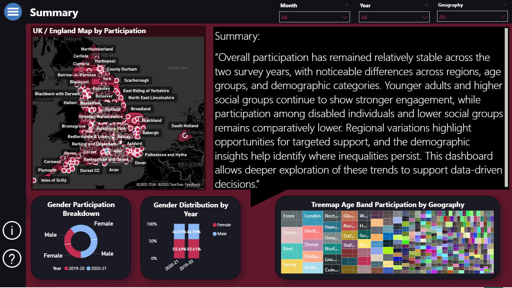
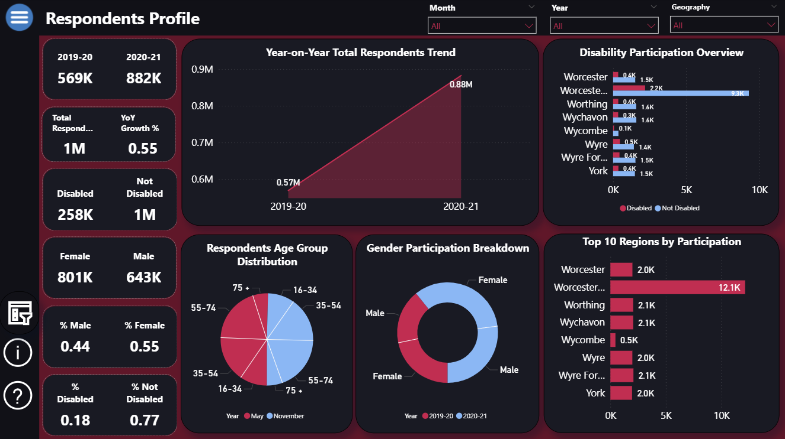
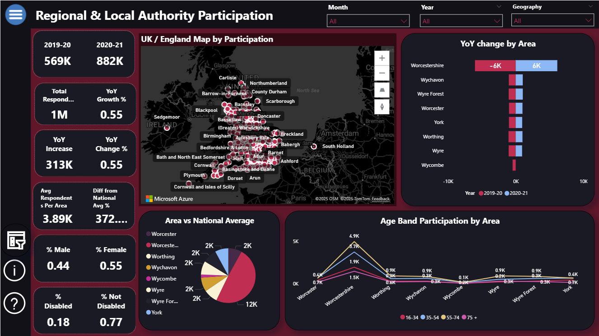
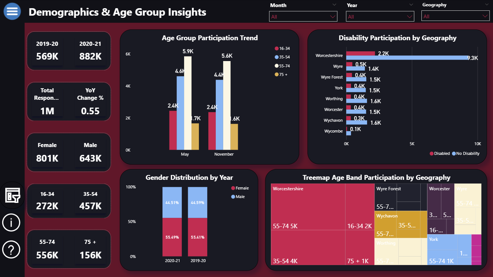
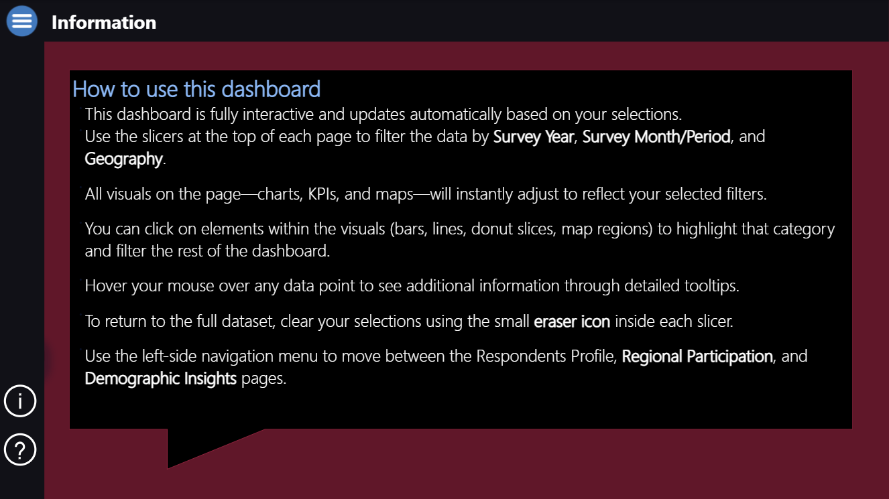
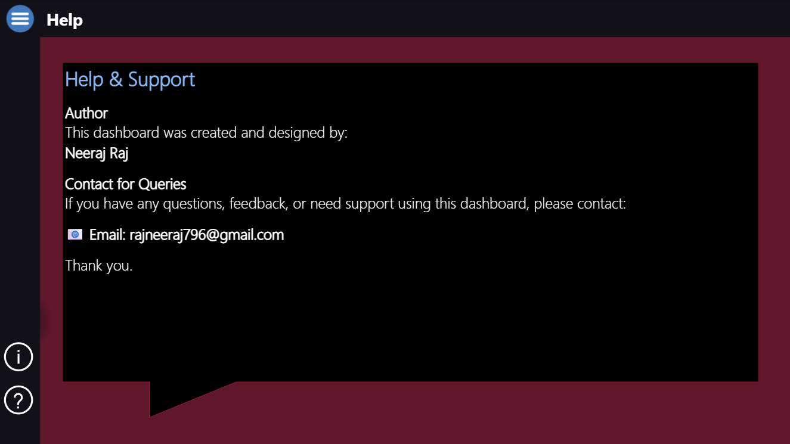

📊 CASE STUDY:England Active Lives Participation Dashboard (2019–20 vs 2020–21)

Author: Neeraj Raj Srinivasa Raju
Tools: Power BI (DAX & Data Modelling), Excel (Validation), SQL (Text Standardisation)
Dataset: Sport England – Active Lives Adult Survey

Scenario

Sport England’s Active Lives Survey provides a comprehensive national view of how adults across England engage in sport and physical activity. While the dataset contains rich insight.

The objective of this project was to transform two survey years (2019–20 and 2020–21) into an interactive Business Intelligence dashboard capable of identifying participation growth, demographic distribution, and regional disparities. The goal was to build an insight tool that supports evidence-based planning and performance benchmarking rather than a static visual report.

🧩 Dashboard Structure

The Summary Page provides an executive-level overview of national participation trends, headline KPIs, and geographic distribution. It is designed for rapid understanding within seconds.

The Respondents Profile Page focuses on demographic segmentation, highlighting gender, disability status, and age-band distribution. This page answers the question of who is participating.

The Regional & Local Authority Participation Page shifts focus to geographic benchmarking. It enables comparison of local authorities against the national average and identifies over- and under-performing regions.

The Demographics & Age Group Insights Page connects demographic patterns with geography, allowing users to explore how inclusion and participation vary across regions and age groups.

The Information Page improves usability by explaining slicers, filters, and interactions, ensuring non-technical stakeholders can confidently navigate the dashboard.

The Help Page provides authorship and support details, reinforcing governance and long-term maintainability.

This structured flow ensures stakeholders first understand the national picture before drilling into drivers and disparities.

❓ Ask

The business task was to analyse year-on-year participation trends and identify where disparities exist across demographics and geographies.

The key analytical questions were:

Is national participation increasing or decreasing year-on-year?

Which regions or local authorities are above or below the national benchmark?

How does participation differ by age, gender, and disability status?

Where are inclusion gaps most visible?

💻 Prepare

Two survey-year datasets were imported into Power BI as separate fact tables due to structural differences. Shared dimension tables for Year and Geography were created to ensure consistent filtering and scalability.

The following core metrics were defined:

Participation KPIs

Total Respondents

Year-on-Year Difference

Year-on-Year Growth %

Demographic KPIs

% Female vs % Male

% Disabled vs % Non-Disabled

Age Band Distribution

Regional Benchmarking KPIs

Respondents by Geography

National Average per Local Authority

Above/Below National Benchmark Indicator

🛠 Process

Data preparation addressed structural mismatches between years. Geography labels were standardised, duplicates were removed through a dedicated dimension table, and numeric fields were validated for accuracy. Excel was used for reconciliation checks and pivot validation, while SQL-style logic helped detect text inconsistencies.

A star schema model was implemented to preserve data integrity and prevent double counting. Advanced DAX functions including CALCULATE, DIVIDE, SUMX, FILTER, SELECTEDVALUE, SWITCH, VAR/RETURN, and time intelligence were used to build dynamic KPIs and year-on-year comparisons.

📊 Analyse

The analysis identified a significant national increase in participation from 569,000 respondents in 2019–20 to 882,000 in 2020–21, representing a growth of 313,000 participants (55% YoY).

While national growth was strong, deeper analysis revealed uneven distribution. Gender participation remained relatively stable, with female respondents forming a slight majority. Age segmentation showed strongest engagement among middle-aged groups, while the 75+ demographic remained comparatively underrepresented. Disability participation accounted for a smaller share relative to non-disabled respondents, highlighting potential inclusion gaps.

Regional benchmarking demonstrated that some local authorities significantly exceeded the national average while others lagged behind, reinforcing the insight that overall growth does not guarantee equitable participation.

📋 Share

The dashboard communicates insights through a progressive narrative structure supported by consistent KPI placement, benchmarking indicators, and interactive filtering. Users can move from national trend analysis to regional and demographic diagnostics without losing context.

The project was published to GitHub with full documentation and screenshots, positioning it as a scalable and professional BI solution.

🎯 Act

By converting over one million survey responses into an interactive insight platform, the dashboard enables evidence-based prioritisation of underperforming regions and demographic groups. It supports inclusive sport development strategies, targeted intervention planning, and more effective resource allocation.

This project demonstrates how structured data modelling and advanced analytics can transform complex public-sector datasets into actionable strategic intelligence.
